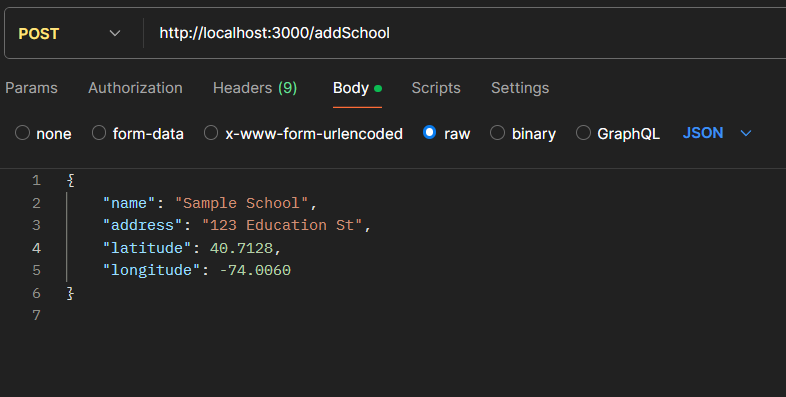
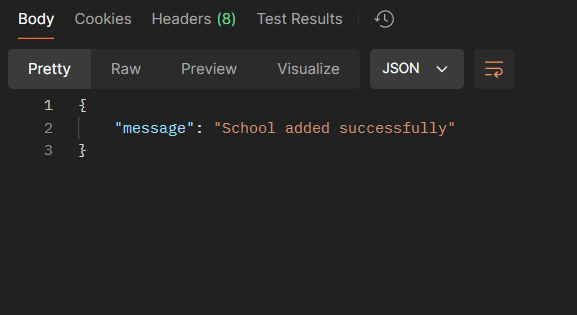
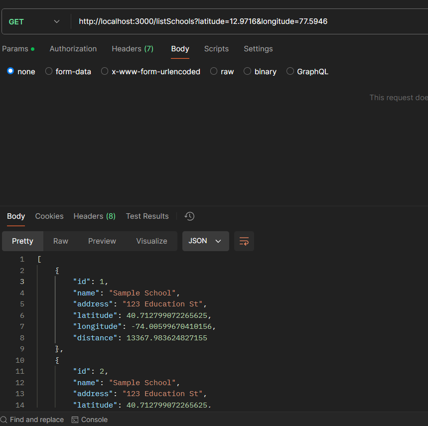
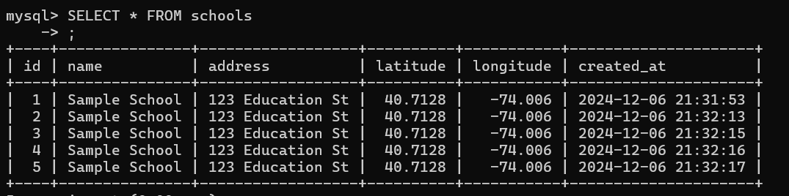

# School Management API

## API Documentation

### 1. Add School
**Endpoint:** `POST /addSchool`

**Payload:**
```json
{
    "name": "ABC School",
    "address": "123 Main Street",
    "latitude": 12.9716,
    "longitude": 77.5946
}
```


**Response:**
```json
{
    "message": "School added successfully"
}
```




### 2. List Schools
**Endpoint:** `GET /listSchools?latitude=12.9716&longitude=77.5946`



**Response:**
```json
[
    {
        "id": 1,
        "name": "ABC School", 
        "address": "123 Main Street",
        "latitude": 12.9716,
        "longitude": 77.5946,
        "distance": 0
    }
]

```
### Database Schema

CREATE TABLE schools (

    id INT AUTO_INCREMENT PRIMARY KEY,
    name VARCHAR(255) NOT NULL,
    address TEXT NOT NULL,
    latitude DECIMAL(10, 8) NOT NULL,
    longitude DECIMAL(11, 8) NOT NULL,
    created_at TIMESTAMP DEFAULT CURRENT_TIMESTAMP

);



